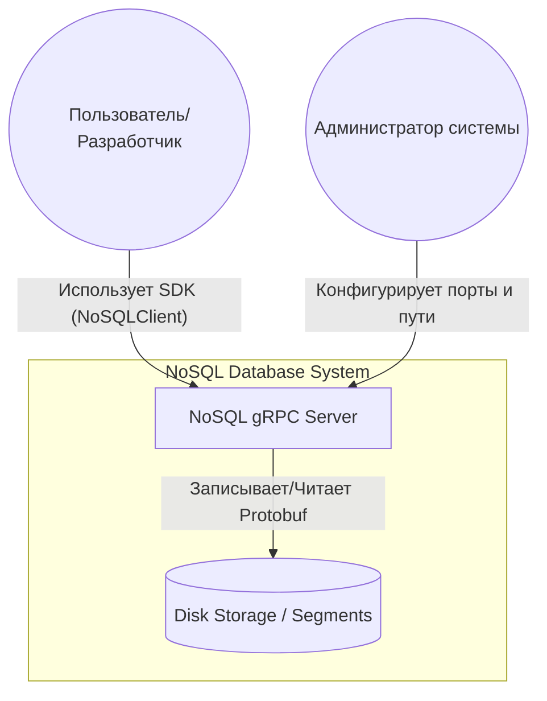
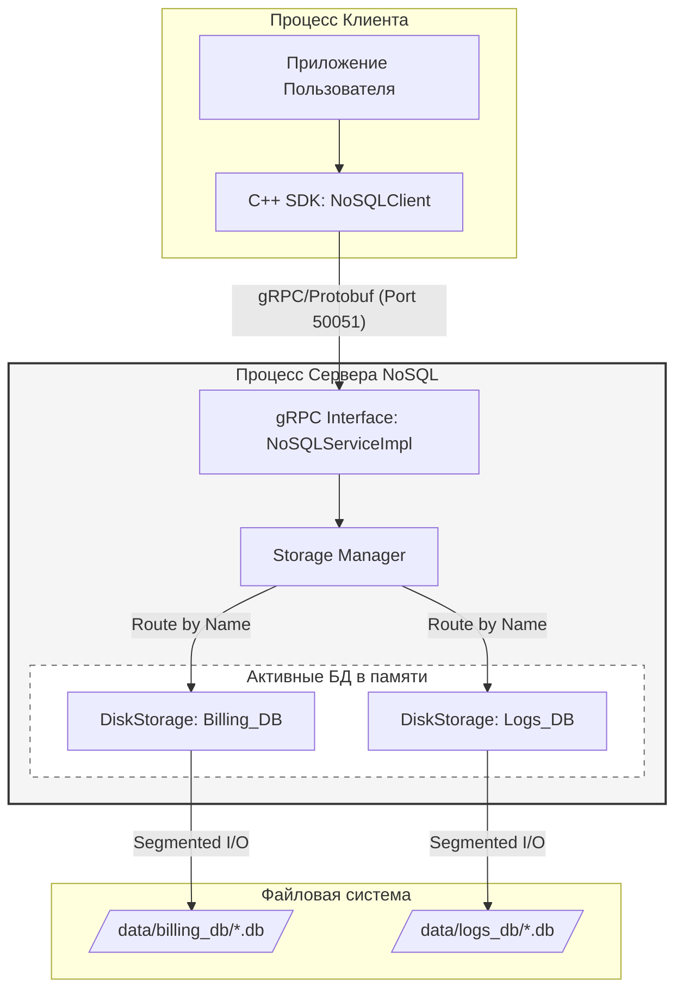
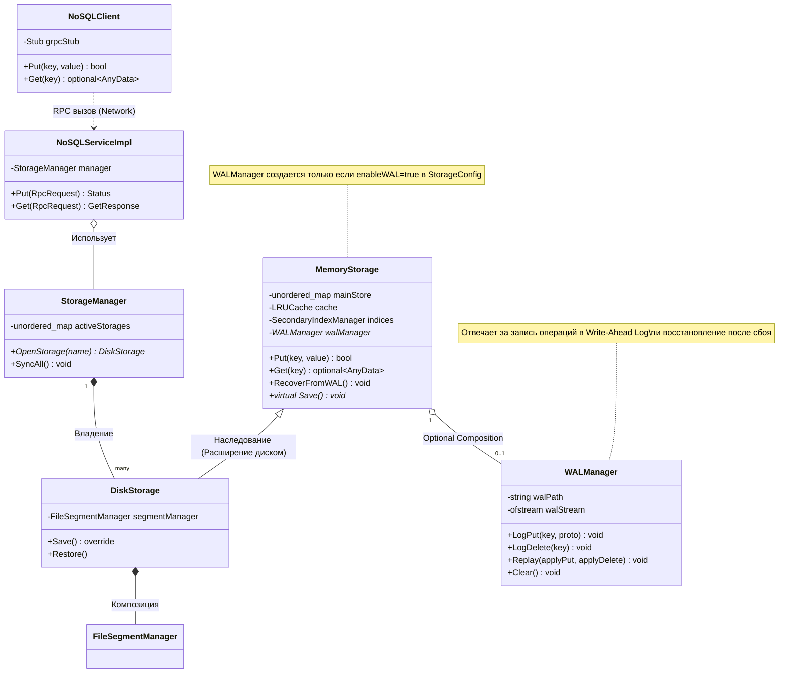

# NoSQL gRPC Database  
**Author:** Sadovnikov Roman  
**Repository:** [nosql_storage](https://github.com/r0973/otus-cpp/tree/feature/nosql_storage)
## Работа выполнена в качестве выпускного проекта в рамках курса С++ Professional

## Описание  
Это высокопроизводительная база данных типа **«ключ-значение»**, написанная на современном **C++**.

## 2. Цели проекта  
### Основная цель:  
Разработка распределенной NoSQL системы хранения данных типа «ключ-значение» с поддержкой сетевого доступа и автоматической персистентностью, а также отказоустойчивостью, которая гарантируется за счет механизма WAL (журналирование операций).  
### Частные цели:  
**2.1. Создание универсального ядра:** Реализация хранилища, способного работать с гетерогенными данными (разных типов) в оперативной памяти.    
**2.2 Обеспечение сохранности данных:** Разработка механизма сериализации и сегментированного хранения данных на диске для защиты от потери информации при перезагрузке.  
**2.3. Реализация сетевого интерфейса:** Создание клиент-серверной архитектуры на базе промышленного протокола gRPC.  
**2.4. Оптимизация доступа:** Внедрение механизмов LRU-кэширования и вторичных индексов для обеспечения высокой скорости обработки запросов.  
**2.5. Обеспечение отказоустойчивости (Durability):** Разработка и интеграция механизма Write-Ahead Logging (WAL) для гарантии сохранности данных при внезапном сбое сервера.

## 3. Критерии завершения проекта (Definition of Done)  
Проект считается успешно завершенным, так как выполнены следующие условия:  
### 3.1. Функциональная полнота:  
**3.1.1.** Реализован полный цикл CRUD (Create, Read, Update, Delete) через сетевой интерфейс.  
**3.1.2.** Данные успешно сохраняются в бинарные сегменты Protobuf и восстанавливаются из них без потерь.  
**3.1.3.** Поддерживается одновременная работа с несколькими независимыми базами данных на одном сервере.  
### 3.2. Техническая валидация:  
**3.2.1. Unit-тесты:** 100% покрытие базовой логики хранения, кэша и индексов.  
**3.2.2. Интеграционные тесты:** Успешное выполнение сценариев «Сетевой запрос -> Сервер -> Диск -> Восстановление».  
**3.2.3. Стресс-демо:** Продемонстрирована стабильная работа сервера под нагрузкой от нескольких параллельных клиентов.  
**3.2.4. Тесты WAL:** Успешное прохождение модульных тестов, демонстрирующих корректное восстановление состояния БД из журнала после имитации сбоя.  
### 3.3. Архитектурное соответствие:
**3.3.1.** Соблюдены принципы SOLID (в частности, OCP — расширение функционала через наследование).  
**3.3.2.** Реализована потокобезопасность (Thread-safety) всех компонентов системы.
**3.3.3.** Гарантирована отказоустойчивость (Durability) данных за счет WAL.

### 3.4. Документация и упаковка:  
Подготовлен README.md с описанием архитектуры и инструкциями по запуску.
Настроен CI/CD (GitHub Actions) для автоматической сборки и проверки проекта.
Подготовлены автоматизированные скрипты для демонстрации функционала (shell-скрипты).  

## 4. Функциональные требования NoSQL Database

|  ID |   Группа  | Требование |   Описание   |
|-----|-----------|------------|--------------|
| FR1   |	**Core API** |	**CRUD операции** |	Поддержка создания (Put), чтения (Get), обновления и удаления (Delete) записей по строковому ключу.
|  FR2  | **Core API** |	**Универсальное хранение** | Protobuf-объекты.
|  FR3  | **Storage** | **Serialization & Persistance** | Автоматический сброс данных из оперативной памяти на диск в бинарном формате **Protobuf**.
| FR4	| **Storage** | **Сегментация файлов** | Разбиение данных на диске на несколько файлов-сегментов (segment_n.db) при достижении лимита maxSegmentSize.
| FR5	| **Storage** |	**Восстановление (Restore)** | Автоматическая загрузка данных с диска в память при инициализации базы данных.
| FR6 | **Storage** | **WAL(Write-Ahead Logging)** | Синхронная запись всех операций изменения (Put, Delete) в журнал для восстановления данных после сбоя.
| FR7	| **Network** |	**gRPC интерфейс** | Возможность удаленного управления базой данных через клиент-серверный протокол на базе gRPC.
| FR8	| **Management** | **Multi-tenancy** | Поддержка работы с несколькими независимыми базами данных (изолированные папки и объекты) на одном сервере.
| FR9	| **Optimization** | **LRU-кэширование** | Автоматическое управление "горячими" данными в памяти для ускорения повторных запросов.
| FR10	| **Optimization** | **Secondary Index** | Возможность поиска данных не только по ключу, но и по значениям полей через предварительно созданные индексы.

## Архитектурная схема



**Внешние сущности:** Пользователь взаимодействует с системой не напрямую, а через SDK (NoSQLClient), что обеспечивает инкапсуляцию сетевой логики.  
**Транспортный уровень:** Взаимодействие между SDK и Сервером происходит по протоколу gRPC. Выбор обоснован бинарной эффективностью и автоматической генерацией кода.  
**Хранение:** Сервер является единственным узлом, имеющим доступ к Файловой системе. Это гарантирует целостность данных.  
**Жизненный цикл:** Стрелка от Файловой системы к Серверу («Restore») подчеркивает наличие механизма восстановления состояния после перезагрузки.  

## Внутренняя схема
**Network Layer (gRPC Service):** Принимает байты, превращает их в объекты AnyData.  
**Management Layer (StorageManager):** Решает, к какому именно хранилищу (БД) относится запрос.  
**Persistence Layer (DiskStorage):** Отвечает за логику сброса данных в файлы и управляет жизненным циклом WAL (checkpointing).    
**Core Layer (MemoryStorage):** Базовая логика в памяти (HashMap, LRU-кэш, Индексы, включая интеграцию с WAL Manager для записи).  




## Архитектура классов



## Уровни иерархии
Распределение обязанностей между классами, их связанность и использование ООП для расширения системы

### 1. Иерархия хранения
Базовый уровень - обепечивает хранение данных в опреативной памяти.
### ```MemoryStorage``` (```Base class```):
**Роль:** Управление данными в оперативной памяти.  
**Механизмы:** ```std::unordered_map``` для данных, ```LRUCache``` для ускорения доступа,  ```SecondaryIndex``` для поиска.  
**Особенность:** Методы работы с данными (```Put/Get```)    

 
### ```DiskStorage``` (Наследник ```MemoryStorage```):  
Этот уровень добавляет персистентность (диск), не ломая логику работы в памяти.   **Роль:** Добавление логики работы с файловой системой.  
**Механизмы:** Владеет ```FileSegmentManager```.  
**Особенность:** Реализует виртуальный метод ```Save()``` и метод ```Restore()```. Он не переписывает логику Put/Get, а дополняет её возможностью сброса состояния на диск.  

### 2. Композиция и управление (```Management```)  
Этот уровень скрывает сложность иерархии хранения от сетевого слоя.  
```StorageManager```:  
**Роль:** Управляет жизненным циклом нескольких баз данных.  
**Механизм:** Инкапсулирует ```std::unordered_map<string, unique_ptr<MemoryStorage>>```.  
**Особенность:** Именно здесь реализуется ```Multi-tenancy``` (возможность работать с разными БД по имени).  

### 3. Сетевой слой и интерфейсы (```Network```)  
Слой, который делает библиотеку сервисом.  
**```NoSQLServiceImpl``` (Server):**    
**Роль:** Адаптер между ```gRPC```-запросами и ```StorageManager```. Превращает ```Protobuf```-сообщения в объекты ```AnyData```.   
**```NoSQLClient (SDK)```:**  
**Роль:** Клиентская обертка. Скрывает детали сетевого обмена (stub, каналы) за простым интерфейсом Put/Get.  

### 4. Контейнер данных
```AnyData:```
**Роль:** Универсальный контейнер. Позволяет хранить int, string и Protobuf-объекты в одной коллекции ```unordered_map```.


### Следование принципам
**Принцип открытости/закрытости (OCP):** Расширение системы добавлением новых классов ```DiskStorage``` и ```NetworkImpl```, а не переписывая исходный ```MemoryStorage```.  
**Единственная ответственность (SRP):** ```MemoryStorage``` отвечает за память, ```DiskStorage``` - за сброс и чтение данных на диск, FileSegmentManager — за файлы, ```NoSQLServiceImpl``` — за сеть.  
**Слабая связность (Low Coupling):** Сетевой клиент ничего не знает о том, как данные лежат на диске, знает только контракт ```*.proto```.


### Структура проекта
```
.
├── CMakeLists.txt
├── Doxyfile
├── Project.md
├── README.md
├── examples
│   ├── CMakeLists.txt
│   ├── basic_usage.cpp
│   ├── benchmark_comparison.cpp
│   ├── final_demo_segmentation.cpp
│   ├── network_client_example.cpp
│   ├── user_proto_example.cpp
│   ├── user_storage_example.cpp
│   └── wal_demo.cpp
├── include
│   ├── lib_version.h
│   └── nosqldb
│       ├── core
│       │   ├── AnyData.h
│       │   ├── NoSQLDataBase.h
│       │   ├── StorageConfig.h
│       │   └── StorageManager.h
│       ├── network
│       │   ├── NoSQLClient.h
│       │   └── NoSQLServiceImpl.h
│       ├── storage
│       │   ├── DiskStorage.h
│       │   ├── FileSegmentManager.h
│       │   ├── LRUCache.h
│       │   ├── MemoryStorage.h
│       │   ├── SecondaryIndex.h
│       │   └── WalManager.h
│       └── utils
│           ├── Logger.h
├── protos
│   ├── CMakeLists.txt
│   ├── anydata.proto
│   ├── nosql_service.proto
│   ├── product.proto
│   ├── storage.proto
│   └── user.proto
├── scripts
│   ├── run_benchmarks.sh
│   └── run_final_demo.sh
├── src
│   ├── CMakeLists.txt
│   ├── lib_version.cpp
│   ├── main.cpp
│   ├── nosqldb
│   │   ├── core
│   │   │   ├── AnyData.cpp
│   │   │   └── StorageManager.cpp
│   │   ├── network
│   │   │   ├── NoSQLClient.cpp
│   │   │   └── NoSQLServiceImpl.cpp
│   │   ├── server
│   │   │   └── main.cpp
│   │   ├── storage
│   │   │   └── FileSegmentManager.cpp
│   │   └── utils
│   │       └── Logger.cpp
│   └── version.h.in
└── unit_tests
    ├── CMakeLists.txt
    ├── boost
    │   ├── CMakeLists.txt
    │   └── test_version.cpp
    └── gtest
        ├── CMakeLists.txt
        ├── test_AnyData.cpp
        ├── test_Concurrent.cpp
        ├── test_LRUCache.cpp
        ├── test_Logger.cpp
        ├── test_NetworkIntegration.cpp
        ├── test_Persistence.cpp
        ├── test_Protobuf.cpp
        ├── test_WalManager.cpp
        ├── test_main_gtest.cpp
        └── test_version.cpp
```

## Демонстрационный пример

В этом разделе рассмотрим демонстрацию рабочего примера под нагрузкой. 

## Сборка и запуск

### Сборка проекта:
```bash
mkdir build && cd build
cmake ..
cmake --build .
```
### Зависимости
#### компилятор C++17 и выше
#### CMake 3.12+
#### gRPC & Protocol Buffers
#### Google Test (для тестов)

### Запуск демо примера:
```bash
../scripts/run_final_demo.sh
```
#### Архитектура теста:
6 клиентов (параллельно) → 1 сервер (gRPC) → 3 базы данных (сегментированные)

#### 📊 Сценарий нагрузки:
| Клиент | База данных | Операции | Количество записей
|-----------|------------|--------------|--------------|
| Клиент 1-2 | billing_db |	Запись + чтение	| 300 записей
| Клиент 3-4 | orders_db | Запись + чтение | 200 записей
| Клиент 5-6 | logs_db | Запись + чтение | 100 записей

Всего: 6 параллельных клиентов, 3 базы данных, 600 операций записи/чтения.

## Ключевые моменты демонстрации:   

**Потокобезопасность на запись**:  
**Потоки:** каждые 2 клиента одновременно пишут в свою базу данных на сервере  
**Механизм:** базы данных обрабатывают параллельные запросы используя блокировки для потоковой безопасности   
**Результат:** данные не перемешиваются, сервер не падает, атомарность операций гарантирована  
**Эффективность gRPC**: cервер держит очередь запросов от 6 клиентов в 3 базы данных и отвечает на запросы    

**Корректная сегментация**:  
```
billing_db/  → 3 файла (300 записей / 100 = 3 сегмента)
orders_db/   → 2 файла (200 записей / 100 = 2 сегмента)  
logs_db/     → 1 файл  (100 записей / 100 = 1 сегмент)
```

**Целостность данных**:  
**Верификация:** Каждый клиент после записи выполняет чтение по ключу    
**Проверка:** Сравнение записанных и прочитанных значений  
**Результат:** 100% совпадение данных, отсутствие потерь  
**Механизм:** Контрольные суммы в заголовках protobuf  

### Демонстрация отказоустойчивости (WAL Demo):
Отдельный пример, демонстрирующий запись данных в WAL без сохранения в сегменты (Save()) и последующее успешное восстановление этих данных при следующем запуске БД.
```bash
../build/bin/wal_demo
```

### Запуск тестов:
```
./bin/unit_tests
```